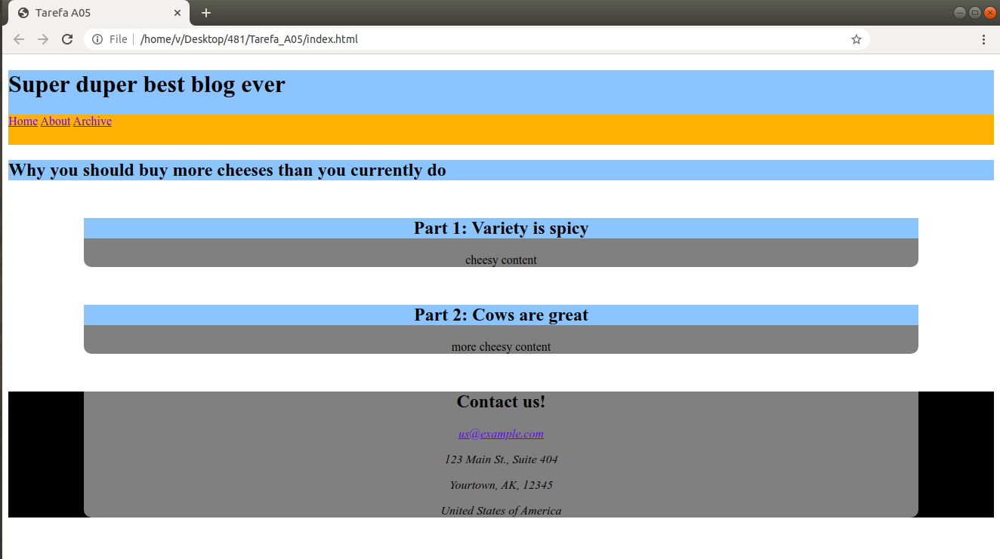

# Tarefa - A05 - CSS 
#Tarefa: 
- Crie o arquivo css correspondente e o preencha de modo a se obter uma página parecida com a da imagem abaixo. 
  As alturas e larguras provavelmente serão diferentes das do exemplo, pois não estou fornecendo a vocês as especificações exatas, mas a aparência geral da página deve se aproximar do exemplo.

- Restrição: o arquivo index.html NÃO deve ser modificado. Edite apenas o arquivo style.css que você criou. Não utilize bibliotecas externas e/ou frameworks.

- Dicas: utilizei as cores "orange", "lightskyblue", "gray" e "black". 