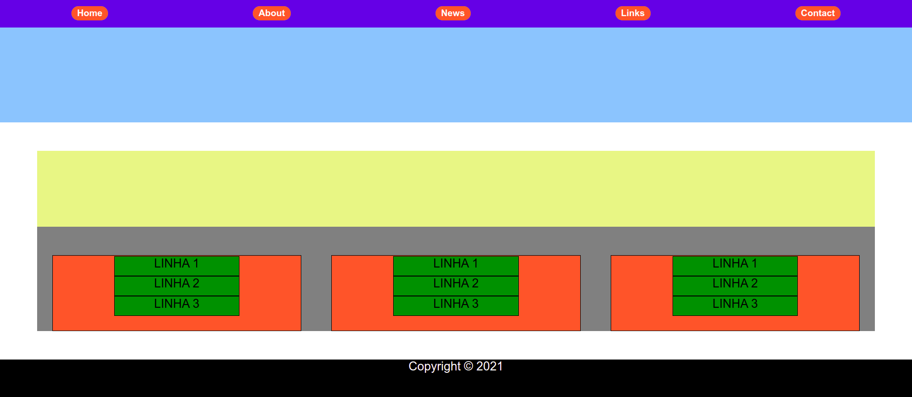

# Tarefa - A07 - FLEXBOX
# Tarefa:
- Entre neste link: http://codepen.io/bee-arcade/professor/18a1165c6b3d812eb226dfd078c7f6a8
e copie os códigos correspondentes em dois arquivos, com nomes index.html e style.css.

A partir deles, reproduza o exemplo da Figura abaixo:
